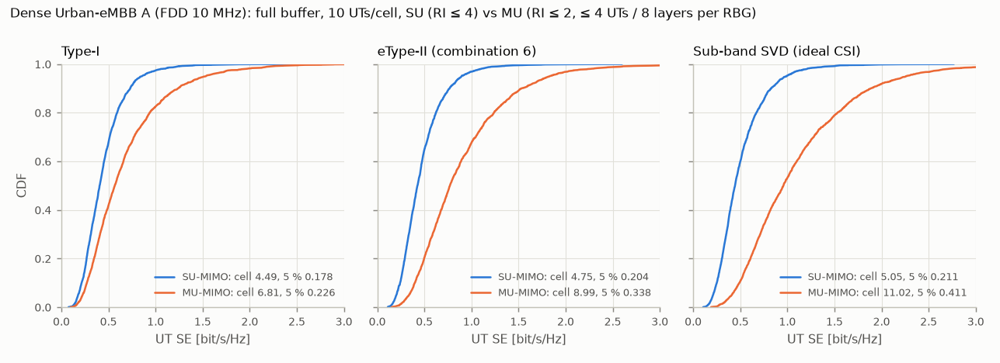

# Benchmark: ITU-R Dense Urban-eMBB against the TR 37.910 self-evaluation

This is the first like-for-like check of the simulator's *throughput* numbers against published results.

The reference is TR 37.910 (3GPP self-evaluation for IMT-2020), Table 5.4.1.2.1-1(a): **NR FDD, Dense Urban-eMBB, evaluation configuration A (4 GHz), 32×4 MU-MIMO, gNB config (8,8,2,1,1;2,8), 15 kHz SCS**. That is exactly our 32T array, and the average over the contributing companies is:

| Reports | Companies | Average SE [bit/s/Hz/TRxP], BW 10 / 20 / 40 MHz | 5th percentile [bit/s/Hz], BW 10 / 20 / 40 MHz |
|---|---|---|---|
| Type II codebook | 11 (channel model A) | 11.04 / 12.52 / 13.39 | 0.37 / 0.42 / 0.45 |
| Type I codebook | 2 | 10.95 / 12.33 / 13.16 | 0.33 / 0.38 / 0.40 |

The ITU-R M.2410 requirement is 7.8 average and 0.225 at the 5th percentile. The M.2412 simulation bandwidth for FDD is 10 MHz + 10 MHz, which is what we compare against. The larger bandwidths in the table show the lower relative overhead of wider carriers.

Reproduce with:

```bash
DU="--preset du-a --codebooks etype2 type1 svd_sb --rbg-size 4 --channel-update 2 \
    --csi-period 5 --pdcch 2 --overhead-re 9"
python examples/run_full_buffer.py $DU --mu --max-rank 2 --tag du_mu
python examples/run_full_buffer.py $DU --tag du_su
python examples/plot_su_vs_mu.py --su results/du_su_full_buffer.json \
    --mu results/du_mu_full_buffer.json --out results/du_su_vs_mu_cdf.png
```

## Results (FDD 10 MHz)

4 drops × 200 slots (40 warm-up), 2280 UTs per configuration.

| Reports | Mode | Average SE [bit/s/Hz/TRxP] | vs TR 37.910 | 5th percentile [bit/s/Hz] | vs TR 37.910 | UTs / layers per RBG | 1st-tx BLER | MU SINR estimate error |
|---|---|---|---|---|---|---|---|---|
| Sub-band SVD (ideal CSI) | MU | **11.02** | 100 % of Type II | **0.411** | 111 % | 3.92 / 7.82 | 0.099 | +0.5 dB |
| eType-II combination 6 | MU | **8.99** | 81 % of Type II | **0.338** | 91 % | 3.88 / 7.68 | 0.103 | +1.7 dB |
| Type-I (sub-band i2) | MU | 6.81 | 62 % of Type I | 0.226 | 68 % | 3.39 / 6.39 | 0.133 | +2.9 dB |
| Sub-band SVD | SU | 5.05 | – | 0.211 | – | 1 / 2.81 | 0.151 | – |
| eType-II | SU | 4.75 | – | 0.204 | – | 1 / 2.28 | 0.150 | – |
| Type-I | SU | 4.49 | – | 0.178 | – | 1 / 2.20 | 0.147 | – |

TR 37.910 reference: Type II 11.04 / 0.37 (11 companies), Type I 10.95 / 0.33 (2 companies). ITU-R M.2410 requirement: 7.8 / 0.225.



### Reading the comparison

- **The chain up to the precoder is in the right range.** With ideal sub-band CSI, the simulated system reproduces the 11-company Type II average (11.02 against 11.04) and exceeds its 5th percentile (0.41 against 0.37). That covers the deployment, channel, overhead level, receiver, link abstraction and MU scheduler together. A geometry, power or overhead error of a few dB, or tens of percent, would show here. The 5th-percentile surplus is expected: ideal CSI serves the cell edge better than any codebook.
- **With a real codebook we are below the companies:** eType-II reaches 81 % of the average and 91 % of the 5th percentile. The gNB's MU-SINR estimate is 1.7 dB optimistic with eType-II against 0.5 dB with ideal CSI. The quantised reports leave interference between co-scheduled UTs that plain ZF on the reports cannot remove, and the SU-CQI-based estimate does not see it. Typical company implementations add some of what we lack, for example regularised ZF / SLNR precoding, MU-CQI or better MU interference estimation, and smarter pairing. Their exact assumptions are in TR attachments not available here. Our overhead estimate (66 % of REs carry data) may also be heavier than some companies'. Closing this gap is MU-precoder work, not calibration.
- **Type-I is further off (62 %),** but that reference comes from only 2 companies and sits almost at the Type II level. That is unusual for a single-beam codebook, so it probably reflects those companies' different assumptions. Our Type-I MU follows the expected trend: its coarse PMI leaves the largest MU-SINR estimate error (+2.9 dB) and BLER (13 %).
- **ITU-R requirements:** eType-II MU (8.99 / 0.338) and ideal CSI meet both. Type-I MU meets the 5th percentile (0.226) but not the average (6.81 < 7.8).
- **MU over SU in Dense Urban:** +89 % with eType-II, +52 % with Type-I and +118 % with ideal CSI. The 200 m ISD and 10 UTs per TRxP give many well-separated UT pairs.
- **SU BLER runs at 15 %,** above the 10 % target. The 30 km/h in-car UTs age their SU CSI faster than a 0.5 dB OLLA step can follow in 160 measured slots. MU transmissions, driven by their own OLLA, stay at 10 %.

## Set-up (`du-a` preset)

| Item | Value | Source |
|---|---|---|
| Layout | 19 sites × 3 TRxPs, ISD 200 m, wrap-around, BS 25 m | M.2412 Table 5b, config A |
| Carrier | 4 GHz, FDD, 10 MHz, 15 kHz SCS, 52 PRB | M.2412 Table 5b; TR 37.910 table |
| Power / noise | 41 dBm per 10 MHz, UT noise figure 7 dB, −174 dBm/Hz | M.2412 Table 5b |
| gNB array | (8,8,2,1,1;2,8), element gain 8 dBi, electrical tilt 102° | TR 37.910 table; M.2412 |
| UTs | 10 per TRxP, 4 ports (1,2,2), 0 dBi; 80 % indoor (floors per TR 38.901), 20 % outdoor in car | M.2412 Table 5b |
| Mobility | indoor 3 km/h, in car 30 km/h | M.2412 Table 5b |
| Propagation | TR 38.901 UMa (= channel model A, which matched the RP-180524 UMa calibration), building loss 20 % high / 80 % low, car loss N(9, 5) dB | M.2412; phase 2 |
| SE normalisation | throughput / 10 MHz channel bandwidth (52 PRB occupy 9.36 MHz) | M.2410 |
| Overhead | PDCCH 2 symbols; DM-RS 24 REs/PRB (2 symbols, also for ports 0–7 with a double-symbol front-loaded DM-RS); CSI-RS 32 ports + CSI-IM every 5 ms, TRS, SSB ≈ 9 REs/PRB/slot → 111 data REs per PRB and slot (66 % of the REs) | our estimate (the companies' overhead assumptions are in TR attachments not available here) |
| CSI | period 5 ms, delay 4 ms, 4-PRB sub-bands (N3 = 13), RI ≤ 2 | |
| MU-MIMO | greedy PF pairing per 4-PRB RBG, ≤ 4 UTs / ≤ 8 layers, zero forcing on the reports, MU OLLA ([results-p4-mu.md](results-p4-mu.md)) | |
| Channel | updated every 2 slots (2 ms: 0.22 λ at 30 km/h, 0.02 λ at 3 km/h) | simplification |

## Decomposition runs (one drop, 100 slots)

These runs located the gap between the first result and the reference. Everything else is as above, and all are MU with eType-II unless noted.

| Variant | Average SE | 5th percentile | UTs / layers per RBG | MU SINR estimate error |
|---|---|---|---|---|
| eType-II, ≤ 2 UTs, DM-RS for > 4 layers charged 4 symbols | 6.80 | 0.276 | 2.0 / 3.9 | +1.7 dB |
| ideal sub-band CSI (`svd_sb`), ≤ 2 UTs | 7.67 | 0.326 | 2.0 / 4.0 | +1.1 dB |
| `svd_sb`, ≤ 4 UTs, 4-symbol DM-RS | 7.51 | 0.318 | 2.8 / 5.6 | +1.0 dB |
| … all UTs at 3 km/h | 7.94 | 0.338 | 2.8 / 5.6 | +0.6 dB |
| … and CSI every slot with 1-slot delay | 8.21 | 0.357 | 2.9 / 5.7 | +0.3 dB |
| eType-II, ≤ 2 UTs, legacy (20 dB) O2I | 7.05 | 0.260 | 2.0 / 3.9 | +1.8 dB |
| **`svd_sb`, ≤ 4 UTs, 2-symbol DM-RS for all layer counts** | **10.96** | **0.414** | 3.9 / 7.8 | +0.5 dB |
| **eType-II, ≤ 4 UTs, 2-symbol DM-RS** | **8.90** | **0.334** | 3.9 / 7.7 | +1.8 dB |
| Type-I, ≤ 4 UTs, 2-symbol DM-RS | 6.86 | 0.238 | 3.5 / 6.6 | +2.7 dB |

- **DM-RS was the largest single error.** Charging 4 DM-RS symbols for more than 4 layers cost 18 % of the data REs of every large MU set, and it made the pairing stop at 2–3 UTs. The low-mobility configuration for ports 0–7, a double-symbol front-loaded DM-RS without an additional position, costs the same 24 REs as the ≤ 4-layer DM-RS. Correcting this moved the ideal-CSI run from 7.5 to 11.0, and MU now defaults to ≤ 4 UTs / 8 layers.
- **CSI ageing, 30 km/h UTs and the O2I model are second-order here** (3–5 % each).
- **With ideal sub-band CSI the MU pipeline reproduces the reference**: 10.96 against 11.04 average, and 0.41 against 0.37 at the 5th percentile.
