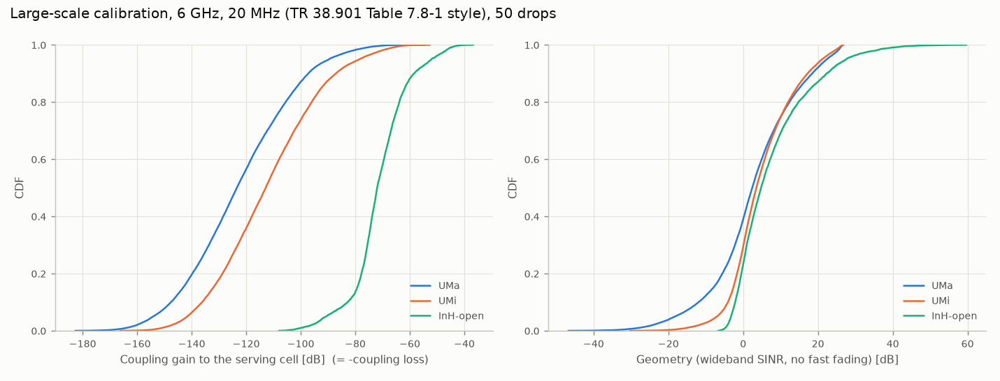
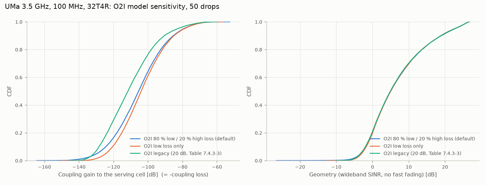
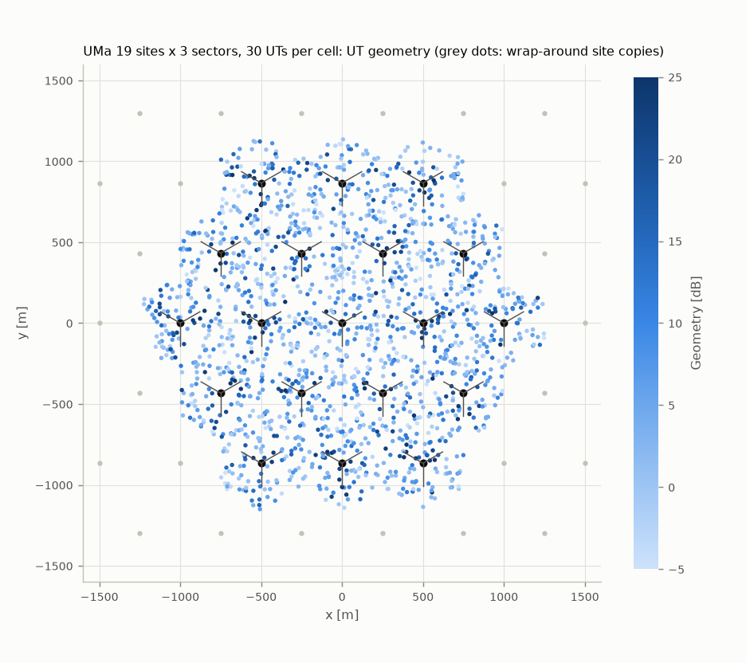
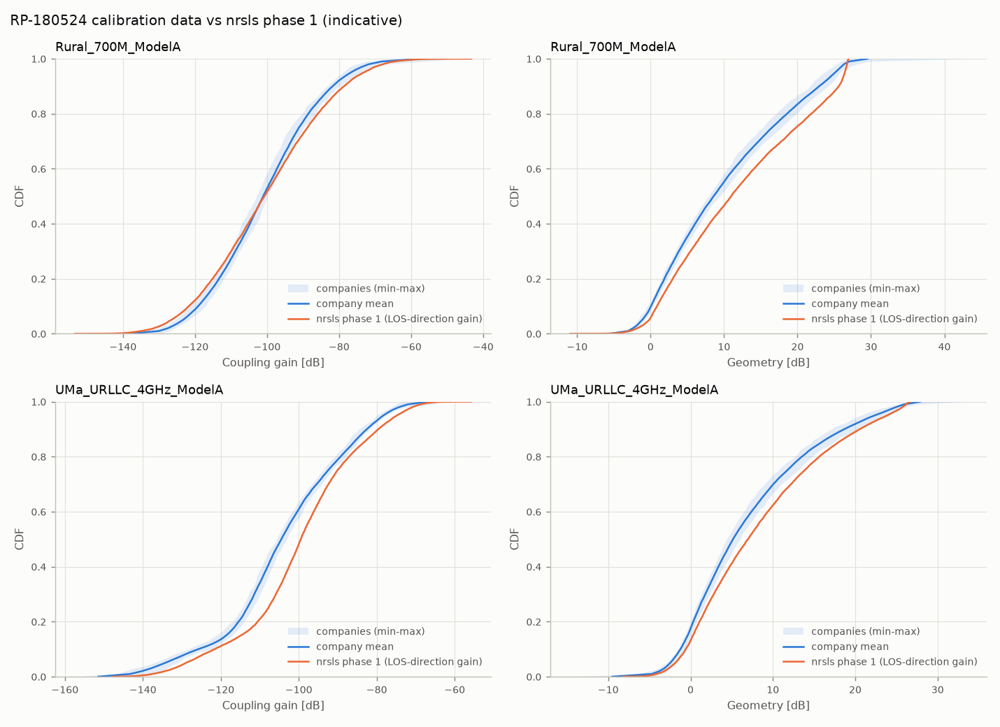

# Phase 1: large-scale geometry, verification and calibration status

Phase 1 of the [module plan](module-plan.md) is implemented. It covers
the deployment, UT drop, large-scale propagation, association, coupling gain
and geometry. It does not include fast fading, which comes in phase 2.

**Status of the exit criterion.** The plan's exit criterion is "coupling-loss /
geometry CDFs within ~1 dB of the TR 38.901 §7.8 calibration". That comparison
is **not done yet**. The industry reference curves are published in the 3GPP
RAN1 calibration-summary contributions, not in the TR text, and 3gpp.org is
blocked by this environment's network policy. Everything that can be checked
without those curves has been checked (see [Verification](#verification)). The
simulator already accepts reference CDFs as CSV and reports the percentile gaps
(see [Comparing against reference curves](#comparing-against-reference-curves)).

Reproduce everything here with:

```bash
pip install -r requirements.txt && pip install -e .
python -m pytest                      # 57 tests, ~10 s
python examples/plot_large_scale.py   # figures + results/p1_summary.json, ~10 s
```

---

## What a drop computes

TR 38.901 §7.5 steps 1–4, without fast fading:

| Step | Module | Spec |
|---|---|---|
| 19 sites × 3 sectors (30°/150°/270°), or the InH hall with 12 TRPs | `topology/layout.py` | TR 38.901 Tables 7.2-1…7.2-3 |
| Wrap-around: each UT sees the closest of 7 copies of every site | `topology/layout.py` | TR 36.814 A.2.1.1 |
| UT drop: per-sector rhombus, minimum 2-D distance, 80 % indoor, floors n_fl ~ U{1..N_fl} with N_fl ~ U{4..8}, h_UT = 3(n_fl−1)+1.5, d2D-in = min of two U(0, 25) | `topology/ue_drop.py` | 7.2, 7.4.3; TR 36.873 |
| LOS state per (site, UT). O2I UTs use d2D-out. | `propagation/los.py` | Table 7.4.2-1 |
| Basic pathloss, including UMa's random h_E breakpoint | `propagation/pathloss.py` | Table 7.4.1-1 |
| O2I loss: low/high/mixed, UT-specific σ_P; legacy 20 dB, link-specific d2D-in; in-car N(9, 5²) | `propagation/o2i.py` | 7.4.3, Tables 7.4.3-1/2/3 |
| Shadow fading: exact exponential spatial correlation on the UT positions, separate LOS/NLOS/O2I fields, independent across sites, shared by co-sited sectors, independent across floors | `propagation/lsp.py` | 7.5 step 4, Table 7.5-6 |
| Port-0 gain toward the LOS direction: element pattern × K-element vertical sub-array with electrical tilt | `antenna/array.py` (reuses `nrdlsim` pattern + rotation) | Table 7.3-1, TR 36.897 5.2.2 |
| Coupling gain; serving cell = strongest RSRP (0 dB margin); geometry = S / (ΣI + N) | `link/`, `engine/drop.py` | Table 7.8-1 |

"Coupling gain" in this code and in the figures is the negative of the 3GPP
coupling loss: CG = G_BS + G_UT − PL_b − SF − L_O2I − L_car.

---

## Verification

| What is checked | How | Test |
|---|---|---|
| Pathloss formulas, all scenarios and branches (PL1/PL2, NLOS, upper floors, RMa) | 11 spot values computed independently from the spec formulas | `test_propagation.py` |
| Breakpoint continuity | UMa/UMi continuous; RMa has a 7 mdB step that is inherent to the spec formula (switch on d2D, evaluation at d3D) | `test_propagation.py` |
| NLOS ≥ LOS everywhere | 400 distances per scenario | `test_propagation.py` |
| UMa h_E | P(h_E = 1 m) = 1/(1+C) = 0.4103 at h_UT = 22.5 m, d2D = 150 m; the rest uniform on {12, 15, 18, 21} | `test_propagation.py` |
| LOS probability | 11 spot values, including the UMa h_UT > 13 m term and both InH variants | `test_propagation.py` |
| O2I | wall losses at 3.5/6/28 GHz; low/high σ_P = 4.4/6.5 dB (Monte Carlo); legacy 20 dB + 0.5 d2D-in | `test_propagation.py`, `test_drop.py` |
| SF fields | unit variance; correlation exp(−d/d_cor) at 20 m and 50 m; 0 across floors; per-condition σ = 4/6/7 dB (UMa) | `test_propagation.py` |
| Layout | ISD spacing, 1/6/12 sites per ring; the 7 cluster copies tile the plane (no overlap, the hex ball of radius 4 is covered); virtual distances equal those of a 49-copy tiling; the sector rhombi tile the site hexagon within ±60° of boresight | `test_layout_antenna.py` |
| UT drop | counts per cell, min distance, indoor share, h_UT formula, E[d2D-in] = 25/3 m, high-loss share | `test_layout_antenna.py` |
| Antenna | peak = G_E,max + 10 log10 K; −3 dB at ±32.5°; 30 dB back-lobe cap; first null of the 10 × 0.8λ sub-array; a panel tilted 90° points down | `test_layout_antenna.py` |
| Association and geometry | serving = argmax; geometry recomputed from received powers; co-sited sectors share link losses; O2I loss is UT-specific (link-specific for legacy) | `test_drop.py` |
| **Wrap-around** | UTs dropped in the centre site and in the outer ring have the same geometry distribution (KS test at 1 %). Without wrap-around the outer ring is > 1 dB better. | `test_drop.py` |
| Reproducibility | fixed seed → identical drops; serial and 2-process runs agree (to 1e-9 dB, BLAS rounding) | `test_drop.py` |

The formulas and parameter tables were also cross-read against an independent
implementation, NVIDIA Sionna 2.1 (`sionna.phy.channel.tr38901`). Pathloss,
LOS probability, h_E, O2I and the SF σ / correlation distances agree. One
interpretation matches Sionna too: O2I links keep the LOS state of their
outdoor part for PL_b.

---

## Results (50 drops)







| Run | UTs | CG p5 | CG p50 | CG p95 | Geom p5 | Geom p50 | Geom p95 | LOS (serving) |
|---|---:|---:|---:|---:|---:|---:|---:|---:|
| `calib-uma` (6 GHz) | 28500 | −154.1 | −123.4 | −89.6 | −18.2 | 2.4 | 22.4 | 0.46 |
| `calib-umi` (6 GHz) | 28500 | −141.6 | −112.8 | −78.5 | −7.0 | 3.5 | 21.1 | 0.72 |
| `calib-inh` (6 GHz) | 6000 | −90.7 | −72.0 | −52.1 | −3.3 | 4.8 | 27.6 | 0.98 |
| `system`, O2I 80/20 low/high (default) | 28500 | −129.7 | −105.4 | −79.2 | −3.3 | 5.0 | 22.6 | 0.46 |
| `system`, O2I low loss only | 28500 | −124.5 | −104.0 | −78.8 | −3.0 | 5.0 | 22.7 | 0.46 |
| `system`, O2I legacy 20 dB | 28500 | −131.4 | −111.6 | −82.8 | −3.3 | 4.9 | 22.7 | 0.45 |

All values in dB. `system` is UMa, 3.5 GHz, 100 MHz (273 PRB at 30 kHz),
53 dBm, 32T4R: (M, N, P) = (8, 8, 2) elements, (Mp, Np) = (2, 8) TXRUs of 4
elements tilted to 102°.

### Observations

- **UMa at 6 GHz is noise-limited in its lower tail.** 26 % of the UTs have a
  serving SNR below 0 dB, and 12 % have geometry below −10 dB. 92 % of those
  UTs sit in high-loss buildings: at 6 GHz the high-loss wall (70 % IRR
  glass, 30 % concrete) costs 30.7 dB, against 13.4 dB for the low-loss wall, plus 0.5 d2D-in and σ_P = 6.5 dB, on every link. How
  deep this tail goes depends directly on the O2I mix assumed for the
  calibration (see below).
- **At 3.5 GHz / 53 dBm the system is interference-limited.** O2I loss is
  UT-specific, so it shifts the serving and the interfering powers equally.
  Switching the O2I model moves coupling gain by up to ~6 dB but geometry by
  less than 0.3 dB.
- **Geometry saturates near 27 dB** in the sectorised scenarios. A UT on
  boresight still receives its two co-sited sectors 30 dB down (the element's
  A_max), so SIR ≤ 30 − 10 log10 2 ≈ 27 dB.
- **Some UTs are served by distant sites.** The serving 2-D distance has a
  95th percentile of ~880 m at ISD 500 m. The UMa LOS probability decays only
  like 18/d, so a LOS site 800 m away (≈ 105 dB at 3.5 GHz) can beat an NLOS
  site at 250 m (≈ 118 dB). This follows from the TR 38.901 model, not from a
  bug: association uses the true per-link LOS state.
- **The calibration antenna has a pattern null near the horizon.** Its
  sub-array is 10 elements at 0.8λ, so its first null sits at a zenith of
  ~94.8°. UTs 150–300 m from the site fall near it, which widens the
  coupling-gain spread.

---

## Assumptions to confirm

The TR 38.901 formulas above are verified. The calibration *set-up* values
below come from my recollection of TR 38.901 Table 7.8-1 and related
evaluation assumptions. They could not be checked against the spec text here.

| Item | Used | Confidence |
|---|---|---|
| Calibration BS antenna: one TXRU, M = 10, dV = 0.8λ | as stated | medium |
| Electrical downtilt 102° (UMa, UMi), 110° (InH) | as stated | medium (InH low) |
| InH TRP orientation: all TRPs face +x (bearing 0°), no mechanical tilt | as stated | **low**. Table 7.8-1 says "no sectorisation" for InH; the orientation of the directional element is unverified. |
| BS power 44 dBm (UMa/UMi, 6 GHz), 24 dBm (InH); 20 MHz; UT NF 9 dB | as stated | medium–high |
| **O2I mix for the calibration: 50 % low / 50 % high loss** | as stated | **low**. This controls the depth of the 6 GHz UMa/UMi tails. |
| System O2I mix: 80 % low / 20 % high loss (TR 38.802 / M.2412 style) | as stated | medium |
| System BS power: 46 dBm per 20 MHz → 53 dBm for 100 MHz | as stated | medium |
| Handover margin 0 dB; RSRP from port 0; isotropic UT | as stated | high |

Each item is a single field of `ScenarioConfig` / `BSAntennaConfig`, and the
calibration presets are built in one place (`calibration_38901` in
`nrsls/config/scenario.py`).

---

## Comparing against reference curves

Put two-column CSV files (`x, cdf`, with cdf in 0…1) into a directory, named
`<preset>_coupling.csv` and `<preset>_geometry.csv`, then run:

```bash
python run_sls.py --preset calib-uma calib-umi calib-inh --drops 50 \
    --reference-dir refs/ --json results/p1_calibration.json
```

For each available curve the runner prints and stores the gap (simulated minus
reference) at the 5/10/20/50/80/90/95th percentiles. `metrics/calibration.py`
has the same functions for notebooks. The plan's "within ~1 dB" criterion is
evaluated as `max_abs_gap`.

---

## Reference curves: TR 37.910 Annex A

`docs/tr_137910v190000p.pdf` is ETSI TR 137 910 V19.0.0 (3GPP TR 37.910
Rel-19). Its Annex A holds the 3GPP system-level calibration for the IMT-2020
self-evaluation: coupling gain and DL geometry (wideband SINR) CDFs,
averaged over 21 companies, for the five ITU-R M.2412 test environments. The
companies' medians lie within 0.4–2.4 dB of the average (Table A.1).

**Extraction.** The figures are vector drawings, so
`examples/extract_tr37910_annexA.py` reads the curves from the PDF paths
rather than digitising pixels:
- the axes are fitted to the tick labels (≤ 0.03 dB residual);
- each curve is traced along the centre of its stroke;
- curves are named from the legend by colour and solid/dashed style.

It writes 50 curves to `refs/tr37910/` (`x_db, cdf`), plus `index.json` and
re-plots (`check_A*.png`) that match the originals. In Figure A.1 the solid
green curve is missing from the legend; it is taken to be Config. C, 36 TRxP.
One invisible path in Figure A.3 matches no legend entry and is skipped.
Coupling gain already uses the nrsls sign (negative dB).

| Figure | Test environment (ITU-R M.2412) | Curves (coupling gain + geometry) |
|---|---|---|
| A.1 | Indoor Hotspot – eMBB: Config A 4 GHz (channel models A/B, 12/36 TRxP), B 30 GHz, C 70 GHz | 8 + 8 |
| A.2 | Dense Urban – eMBB: Config A 4 GHz (A/B), Config B 30 GHz, all "w/ analog BF" | 3 + 3 |
| A.3 | Rural – eMBB: Config A 700 MHz, B 4 GHz (ISD 1732 m), C LMLC 700 MHz (ISD 6000 m) | 6 + 6 |
| A.4 | Urban Macro – mMTC: Config A (ISD 500 m) / B (1732 m), 700 MHz | 4 + 4 |
| A.5 | Urban Macro – URLLC: Config A 4 GHz, B 700 MHz | 4 + 4 |

**How the curves apply.** "Channel model A" is the TR 38.901 model that
nrsls implements. "Channel model B" is the ITU-R M.2412 alternative, and
its curves are kept for reference only. Two points in Annex A decide when a
curve can be matched:

1. **UE attachment is multi-path based.** The coupling gain sums the power
   of every ray, each weighted by the antenna gains in its own direction. It
   is not the gain toward the LOS direction that phase 1 uses. With
   directional, tilted BS antennas the two differ by several dB, mostly for
   NLOS UTs. Multi-path coupling needs the phase-2 cluster and ray
   generation, so **these curves are the phase-2 exit criterion**. Phase 1
   can only be compared indicatively.
2. **The set-up is not in the TR.** Annex A points to §4 of RP-180524, and
   the per-configuration details (tilt, calibration antenna/port mapping,
   power, noise figure, handover margin, the analog-BF model) are in
   RP-180524 and ITU-R M.2412. The ETSI PDF does not include the B.4 zip
   attachments. The TR does confirm, for example, the Dense Urban 32T gNB
   (8,8,2,1,1;2,8), the same array as the `system` preset.

Plan: add `m2412-*` presets once RP-180524 §4 (or M.2412 Table 5-x) is
available. Then compare the channel-model-A curves through
`metrics.calibration.percentile_gaps`, with the pass bar at "within the
inter-company spread of Table A.1, and ≤ 1 dB at the median". Figures A.3,
A.4 and A.5 (no analog BF) come first, then A.1/A.2 once the analog-BF
attachment model is added.

Re-extract with `pip install -e .[refs] && python examples/extract_tr37910_annexA.py --check`.

---

## RP-180524: calibration set-up and per-company data

`docs/RP-180524 ...docx` gives the baseline calibration parameters for every
M.2412 test environment (§4, Tables 1–5). The attached zip holds each
company's coupling-gain and geometry CDFs at the 0…100 % points (12–20
companies per configuration). `examples/import_rp180524.py` turns them into
`refs/rp180524/<sheet>_<metric>.csv` (`pct, mean, min, max, <company>…`).
These are the data behind TR 37.910 Figures A.1–A.5 and supersede the curves
extracted from the PDF. The PDF curves differ from the spreadsheet means by up
to ~1 dB, probably because the figure averages horizontally rather than per
percentile.

**What RP-180524 fixes:**
- attachment is the port-0 RSRP of **TR 36.873 eq. (8.1-1)**, summed over
  every ray with the element and sub-array gain in that ray's direction,
  with a 0 dB handover margin;
- Rural / UMa-mMTC / UMa-URLLC use vertical 8-element TXRUs at 0.8λ with
  electrical tilts of 100° / 96° (LMLC) / 99° / 93° (mMTC 1732 m);
- 46 dBm in 10 MHz, UE noise figure 7 dB, all UEs at 1.5 m, d2D_min = 10 m,
  geographic wrap-around;
- Dense Urban config A and InH use analog-beam sets (2-D DFT sub-arrays)
  and, for InH, ceiling TRPs pointing down.
- The building-loss mix "applies to channel model B". For channel model A
  the data point clearly to the legacy 20 dB O2I model (TR 38.901 Table
  7.4.3-3) in UMa: with the 80/20 low/high mix the UMa coupling gain is 8–16 dB
  above the company mean, and with the legacy model 2–6 dB.

`nrsls.config.scenario.rp180524()` builds the seven configurations the
current antenna model covers (`rp-rural-700m`, `rp-rural-4g`, `rp-rural-lmlc`,
`rp-mmtc-500m`, `rp-mmtc-1732m`, `rp-urllc-4g`, `rp-urllc-700m`).

### Phase-1 comparison (indicative, 30 drops)

`python examples/compare_rp180524.py` → `results/p1_rp180524_gaps.json`,
`results/p1_rp180524.png`. Gap = nrsls − company mean, in dB:

| Config (channel model A) | Coupling gain p5 / p50 / p95 | Geometry p5 / p50 / p95 |
|---|---|---|
| Rural 700 MHz | −3.3 / +0.3 / +3.6 | +0.9 / +2.4 / +1.3 |
| Rural 4 GHz | −5.2 / −1.3 / +3.2 | −0.8 / +1.8 / +1.8 |
| Rural LMLC (ISD 6 km) | −11.0 / −8.6 / +0.1 | −1.1 / 0.0 / +2.6 |
| UMa-mMTC 500 m | +5.8 / +3.0 / +1.9 | +0.5 / +1.8 / +2.0 |
| UMa-mMTC 1732 m | +3.7 / +3.0 / +2.5 | +1.1 / +1.7 / +3.7 |
| UMa-URLLC 4 GHz | +5.3 / +5.0 / +3.5 | +0.6 / +1.8 / +1.5 |
| UMa-URLLC 700 MHz | +5.7 / +5.7 / +2.9 | +0.3 / +1.8 / +1.4 |



The company envelope is narrow (typically ±1 dB), so these gaps are real.
They have the signature expected from the one phase-1 simplification:
- **UMa coupling gain is 3–6 dB too high.** Phase 1 applies the full
  sub-array gain toward the LOS direction. The eq. (8.1-1) RSRP spreads the
  power over clusters whose zenith and azimuth spreads fall partly outside
  the narrow 8 × 0.8λ vertical beam and the 65° element.
- **Geometry is 1–3 dB too optimistic.** For the same reason, co-sited and
  neighbouring sectors leak more power under multipath than toward a single
  LOS direction. Phase 1 caps SIR at the 27 dB front-to-back limit, while
  the companies' curves run past it.
- **Rural coupling gain is too wide:** the tails are ±3–5 dB with the median
  right. **LMLC is 9 dB low at the median.** This does not look like the
  antenna effect. The pathloss/LOS set-up at 6 km ISD needs checking first
  in phase 2.

### Next steps
1. **Phase 2:** TR 38.901 §7.5 steps 4–11 (correlated LSPs, clusters, rays)
   and the eq. (8.1-1) port-0 RSRP. Then rerun this comparison. The target is
   every percentile inside the company envelope, or within ±1 dB of the mean.
2. Resolve LMLC.
3. 2-D DFT analog-beam sub-arrays and beam-set attachment for Dense Urban
   config A. InH with ceiling TRPs and the M.2412 Table 8-7 element.

