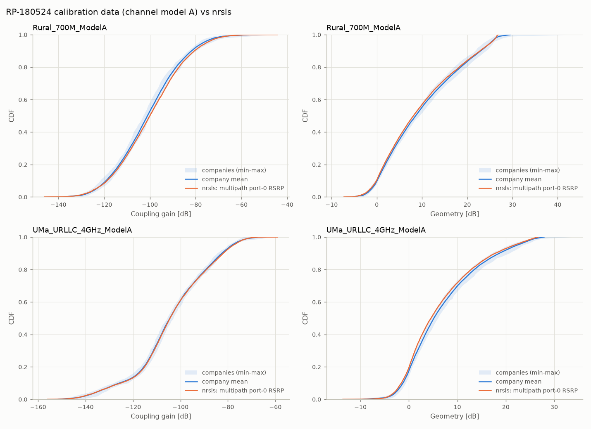

# Phase 2: TR 38.901 fast fading and the 3GPP IMT-2020 calibration

Phase 2 adds the TR 38.901 §7.5 small-scale model on top of the phase-1
geometry ([calibration-p1.md](calibration-p1.md)). The calibration
reference is the per-company data of RP-180524 (the source of TR 37.910
Annex A): 12–20 companies per configuration.

**Result.** With the multipath coupling model used by the calibration, **all 7
RP-180524 configurations that nrsls can set up match the company data**.
Nearly all percentiles lie inside the companies' min–max envelope, and the
gaps to the company mean are mostly within ±0.7 dB (never more than 1.5 dB).
Rural LMLC needed the LMLC NLOS pathloss of ITU-R M.2412 (see below).

Reproduce:

```bash
python examples/import_rp180524.py            # refs/rp180524 from the zip (once)
python examples/compare_rp180524.py --drops 30 --jobs 4
python -m pytest                              # 72 tests, ~45 s
```

---

## What was added

| Step (TR 38.901 §7.5) | Module |
|---|---|
| 4: all seven LSPs (SF, K, DS, ASD, ASA, ZSD, ZSA), each a spatially correlated field with its own correlation distance, mixed by the Table 7.5-6 cross-correlation matrix, per site and link condition (LOS/NLOS/O2I); distance-dependent ZSD mean and ZOD offset (Tables 7.5-7…10); spreads clipped to 104° / 52° | `propagation/lsp.py`, `propagation/lsp_tables.py` |
| 5–10: cluster delays, powers (−25 dB pruning, K-scaled powers for the angles), AOA/AOD/ZOA/ZOD with the LOS re-alignment and the ZOD offset, the 20 ray offsets, random ray coupling, per-ray XPR, initial phases; O2I links have no LOS ray and a mean ZOA of 90° | `propagation/clusters.py` |
| Port-0 RSRP of TR 36.873 eq. (8.1-1) summed over rays: polarised element field (model 2, ±45° gNB, 0°/90° UT) × TXRU sub-array gain, per-ray XPR and phases, averaged over UT ports; used for attachment, coupling gain and geometry (`coupling_model="multipath"`, now the default) | `link/rsrp.py`, `engine/drop.py` |
| 11–12: channel matrix H[t, f, u, s] per link. Port responses include array location phases; the two strongest clusters are split into sub-clusters; Doppler from the UT velocity; LOS ray. Port order: polarisation, then horizontal, then vertical TXRU (the TS 38.214 N1/N2 ordering) | `propagation/fast_fading.py` |

`coupling_model="los"` keeps the phase-1 model (gain toward the LOS
direction), which reproduces the phase-1 results.

---

## Calibration against RP-180524 (channel model A, 30 drops)

Gap = nrsls − company mean [dB] at the 5 / 10 / 20 / 50 / 80 / 90 / 95th
percentiles. "Env." = share of those percentiles inside the companies'
min–max envelope.

| Configuration | Coupling gain gap | Env. | Geometry gap | Env. |
|---|---|---:|---|---:|
| Rural 700 MHz | −0.2 +0.4 +0.7 +1.1 +1.3 +1.2 +1.5 | 100 % | −0.3 −0.1 −0.3 −0.5 −0.3 −0.1 +0.1 | 100 % |
| Rural 4 GHz | −1.4 −1.1 −0.9 −0.3 +0.0 +0.5 +0.9 | 100 % | −0.6 −0.4 −0.4 −0.5 −0.1 −0.0 +0.1 | 86 % |
| UMa-mMTC 500 m | +0.0 −0.3 −0.3 −0.1 −0.2 +0.2 +0.1 | 100 % | −0.1 −0.1 −0.0 −0.2 +0.0 −0.1 +0.0 | 100 % |
| UMa-mMTC 1732 m | +0.7 +0.3 +0.1 −0.1 +0.1 −0.3 −0.4 | 100 % | −0.1 −0.3 −0.2 −0.2 −0.1 −0.2 −0.1 | 100 % |
| UMa-URLLC 4 GHz | −0.2 +0.6 +0.4 +0.1 +0.3 +0.6 +0.6 | 100 % | −0.3 −0.3 −0.3 −0.6 −0.7 −0.8 −0.6 | 100 % |
| UMa-URLLC 700 MHz | −0.1 +0.1 +0.4 +0.2 +0.3 +0.7 +0.2 | 100 % | −0.4 −0.3 −0.3 −0.6 −0.7 −0.8 −0.6 | 100 % |
| Rural LMLC (ISD 6 km) | −1.3 −0.5 +0.1 +0.6 +0.7 +0.7 +0.1 | 100 % | −0.5 −0.5 −0.3 −0.2 −0.1 −0.0 +0.2 | 100 % |



The phase-1 model sat 3–6 dB high on UMa coupling gain and 1–3 dB high on
geometry ([results/p1_rp180524.png](../results/p1_rp180524.png)). Three
effects of eq. (8.1-1) closed that gap:
- **Polarisation.** A +45° gNB port seen by 0°/90° UT ports loses about
  2–3 dB, depending on the XPR.
- **Angular spread.** Rays spread over zenith and azimuth partly miss the
  narrow 8 × 0.8λ vertical beam and the 65° element.
- **Sector leakage.** More power reaches the neighbouring and co-sited
  sectors, which lowers geometry and removes the phase-1 27 dB SIR ceiling.

**Choices confirmed by the data:**
- the UMa building loss for channel model A is the TR 38.901 legacy model
  (20 dB + 0.5 d2D-in). The 80/20 low/high mix is 8–16 dB off.
- O2I links keep their outdoor LOS state for the pathloss but have no LOS
  ray.

**Checks** (tests in `tests/test_fast_fading.py`):
- LSP moments and cross-correlations match Table 7.5-6: lg DS mean and std,
  DS–ASD = +0.4, SF–ASD = −0.6 for UMa NLOS;
- the ZSD / ZOD-offset spot values;
- cluster invariants: the power sum, −25 dB pruning, sorted delays, the
  first cluster aligned to the LOS direction, K > 0 only on LOS links, O2I
  arrival zenith around 90°;
- the RSRP is exactly power-conserving for isotropic co-polarised ports;
- H(f, t) averaged over time and frequency equals the eq. (8.1-1) RSRP
  (< 0.3 dB mean difference), and H is static without motion.

---

## Open items

1. **Rural LMLC: closed.** The workbook notes "New LMLC pathloss for NLOS
   is used". ITU-R M.2412 (`docs/R-REP-M.2412-2017-PDF-E.pdf`, RMa pathloss
   table) defines it for LMLC as PL_NLOS = max(PL_RMa-LOS, PL'_RMa-NLOS −
   12 dB), valid for 10 m < d2D < 21 km. It is implemented as
   `ScenarioConfig.rma_nlos_offset_db = 12` in the `rp-rural-lmlc` preset.
   It moved LMLC from −10.6 dB to +0.6 dB at the median.
2. **Dense Urban config A and Indoor Hotspot** (RP-180524 Tables 1–2) need
   analog-beam sets (2-D DFT sub-array weights, best-beam-pair attachment,
   random interferer beams). Indoor Hotspot also needs ceiling TRPs and the
   M.2412 Table 8-7 element (5 dBi). The reference data is already in
   `refs/rp180524/`.
3. **Runtime.** A multipath drop takes ~3 s (57 cells × 570 UTs, all
   links). Phase 3 only needs full channel matrices for the serving cell +
   K strongest interferers.
