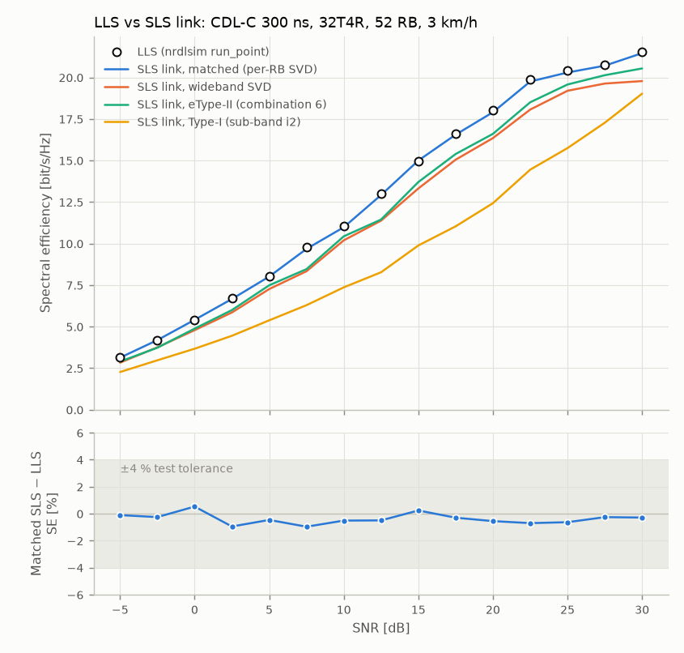

# LLS ↔ SLS single-link regression

This closes the second phase-3 exit criterion of the [module plan](module-plan.md) (§5.3, §6):
fix one SLS link, replace the interference by white noise, and check that its spectral
efficiency matches the link-level simulator `nrdlsim` at the same SNR.

Reproduce with:

```bash
python examples/lls_regression.py --jobs 4 --seeds 3     # ~2.5 min on 4 cores
python -m pytest tests/test_lls_regression.py             # the regression test, ~6 s
```

The first command writes `results/p3_lls_regression.json` and `results/p3_lls_regression.png`.

## Method

Both simulators run on **the same channel realisation**: the `nrdlsim` CDL channel with the same seed and the same time evolution, H per RB at the RB centres. The SLS side (`nrsls.engine.single_link.run_single_link`) runs the same code objects as the full-buffer system loop:

- `CSIProcessor` for RI/PMI/CQI;
- `LinkAdaptation` for CQI → SINR, OLLA and MCS selection;
- the per-TB steps in `nrsls/engine/link.py`: MCS/TBS, precoder lookup, MMSE SINR, chase combining and MIESM BLER.

Those steps were moved out of `fullbuffer.py` for this purpose. The system loop is bit-identical before and after the move (checked on a fixed-seed drop for Type-I, eType-II and SVD).

| Item | LLS (`NRDownlinkSimulator.run_point`) | SLS link, matched set-up (`matched_fb`) |
|---|---|---|
| Channel | `nrdlsim` CDL, ideal channel estimation | the same H(f, t); ports re-ordered from the LLS panel order (row, column, polarisation) to the SLS/TS 38.214 CSI-RS order s = p N1 N2 + n N2 + m |
| Power | unit-power H, noise 10^(−SNR/10), W / √rank | H × 10^(SNR/20) in units of the noise per RE, unit-norm precoder |
| Precoder | per-RB SVD | `svd_rb`: per-RB SVD (a new ideal CSI option) |
| RI / CQI | every slot, wideband, 4-slot delay | CSI period 1 slot, one sub-band over the allocation, 4-slot delay |
| Link adaptation | CQI → SINR − OLLA → MCS, OLLA 0.5 dB | the SLS `LinkAdaptation` with the same rule and steps |
| HARQ | 1 process, retransmission in the next slot, 4 transmissions, chase combining | HARQ RTT 1 slot, 4 transmissions, chase combining |
| L2S | MIESM → BLER (`nrdlsim.link_abstraction`) | the same functions |

What remains different is bookkeeping:

- The LLS sends MCS-16, rank-1 TBs in the 4 slots before its first CSI report arrives; the SLS waits for the report. This explains the small negative SE bias of the SLS (about −0.5 %) and its about 0.05 higher mean rank.
- The LLS precodes a retransmission with the newest report's precoder; the SLS keeps the TB's precoder.
- The LLS averages rank and MCS over all transmissions; the SLS averages them over first transmissions.

Everything else is random draws (ACK/NACK). One 200-slot run has about 1 % Monte-Carlo spread in SE.

## Results

### Matched link: SE vs SNR on the system array

CDL-C, 300 ns, 3 km/h, 3.5 GHz, 52 RB at 30 kHz, 32T4R ((N1, N2) = (8, 2), 4 cross-polarised UT ports), 200 slots, 3 channel seeds per point.



| SNR [dB] | −5 | 0 | 5 | 10 | 15 | 20 | 25 | 30 |
|---|---|---|---|---|---|---|---|---|
| LLS SE [bit/s/Hz] | 3.14 | 5.38 | 8.05 | 11.04 | 14.96 | 18.01 | 20.43 | 21.52 |
| SLS matched SE | 3.13 | 5.41 | 8.02 | 10.98 | 15.00 | 17.91 | 20.30 | 21.46 |
| Difference | −0.1 % | +0.5 % | −0.5 % | −0.5 % | +0.2 % | −0.5 % | −0.6 % | −0.3 % |

All 15 points of the 2.5 dB grid are within **−1.0 % … +0.5 %**.

### Matched link: channel models and array sizes

Same settings, 3 seeds per point. Each cell shows LLS / SLS.

| Configuration | SNR [dB] | SE [bit/s/Hz] | Difference | First-tx BLER | Mean rank |
|---|---|---|---|---|---|
| CDL-A 100 ns, 32T4R | 0 / 10 / 20 | 4.31/4.29 · 8.26/8.22 · 13.26/13.17 | −0.6 · −0.4 · −0.6 % | 0.087/0.085 · 0.093/0.091 · 0.095/0.092 | 2.10/2.12 · 2.76/2.79 · 3.29/3.33 |
| CDL-C 300 ns, 32T4R | 0 / 10 / 20 | 5.38/5.41 · 11.04/10.98 · 18.01/17.91 | +0.5 · −0.5 · −0.5 % | 0.091/0.087 · 0.087/0.089 · 0.087/0.087 | 3.16/3.21 · 3.54/3.60 · 3.94/4.00 |
| CDL-D 30 ns (LOS), 32T4R | 0 / 10 / 20 | 4.78/4.73 · 8.73/8.71 · 11.73/11.60 | −1.1 · −0.3 · −1.1 % | 0.083/0.083 · 0.083/0.083 · 0.083/0.087 | 1.98/2.00 · 1.98/2.00 · 2.96/3.00 |
| CDL-C 300 ns, 8T4R | 0 / 10 / 20 | 2.78/2.75 · 7.46/7.41 · 13.70/13.67 | −1.0 · −0.8 · −0.2 % | 0.089/0.091 · 0.087/0.089 · 0.087/0.087 | 2.30/2.32 · 3.22/3.26 · 3.66/3.71 |
| CDL-C 300 ns, 4T2R | 0 / 10 / 20 | 1.43/1.46 · 4.15/4.07 · 7.63/7.59 | +1.8 · −2.0 · −0.5 % | 0.082/0.081 · 0.093/0.091 · 0.083/0.085 | 1.32/1.33 · 1.98/2.00 · 1.98/2.00 |

**Worst difference: 2.0 %.** BLER agrees within 0.004 and rank within 0.06.

### Regression test

`tests/test_lls_regression.py` runs an 8T4R CDL-C link (24 RB, 200 slots) at 0, 10 and 20 dB. It requires:

- SE within **4 %**;
- first-transmission BLER within 0.03;
- mean rank within 0.15;
- mean MCS within 0.6.

It also checks two things that make the test meaningful:

- **The tolerance is sensitive.** Shifting the SLS SNR by ±1 dB moves SE by 6–9 %, so a 1 dB normalisation error fails the test.
- **The port mapping is right.** The LLS → SLS port permutation is checked by hand on a (2, 2) panel.

The test also runs Type-I and eType-II on the LLS channel.

## What the SLS CSI options cost on this link

Same channel, 4-RB CSI sub-bands (N3 = 13 for eType-II), CSI every slot, 4-slot delay. These rows are **not** part of the pass/fail criterion. They show the precoding loss of each CSI option against ideal per-RB SVD, with everything else identical.

| SNR [dB] | 0 | 10 | 20 | 30 |
|---|---|---|---|---|
| Per-RB SVD (matched) | 5.41 | 10.98 | 17.91 | 21.46 |
| Wideband SVD | 4.79 (−11 %) | 10.20 (−7 %) | 16.35 (−9 %) | 19.78 (−8 %) |
| eType-II, combination 6 | 4.88 (−10 %) | 10.44 (−5 %) | 16.61 (−7 %) | 20.54 (−4 %) |
| Type-I, sub-band i2 | 3.67 (−32 %) | 7.37 (−33 %) | 12.43 (−31 %) | 19.03 (−11 %) |

- **eType-II matches or beats unquantised wideband SVD at every SNR** (all points from 0 dB up; −1 % at −2.5 dB). A per-sub-band precoder with 7 of 13 FD basis vectors follows the 300 ns frequency selectivity better than one wideband precoder, despite quantisation.
- **Type-I's loss is concentrated in ranks 3–4.** The per-rank capacity on this channel at 10 dB (one snapshot, exhaustive codebook search), best codeword against wideband SVD, is:
  - rank 1: 8.8 vs 9.2 bit/s/Hz (−4 %);
  - rank 2: 14.7 vs 15.5 bit/s/Hz (−5 %);
  - rank 3: 16.2 vs 20.0 bit/s/Hz (−19 %);
  - rank 4: 17.0 vs 21.5 bit/s/Hz (−21 %).

  This is the TS 38.214 Table 5.2.2.2.1-7/8 structure for P ≥ 16. Every layer uses the same half-array beam ṽ_{l,m}, and the layers are separated only by the θ_p / φ_n sign patterns. That cannot follow the several angular clusters of CDL-C. With MMSE per-layer SINRs, Type-I therefore settles on rank ≈ 2 (2.07 at 10 dB, against 3.7–4.0 for SVD / eType-II).
- **Sub-band i2 was added to Type-I for this comparison** (`pmi-FormatIndicator = subbandPMI`, now the default; `pmi_subband=False` gives the wideband report). i1 is wideband and maximises the sum over sub-bands of the best per-sub-band rate, and each sub-band then gets its own co-phasing i2. It costs 2 bits (rank 1) or 1 bit (ranks 2–4) per sub-band. On this link it makes no significant difference (≤ 1.4 % against the wideband-i2 report, within the run-to-run spread), because the loss is in the beam structure, not the co-phasing.
- **The port mapping is confirmed by the codebook itself.** On the same channel, Type-I ranks 2–4 reach 15–68 % higher capacity (0 and 10 dB) with the correct LLS → SLS permutation than with the LLS order used as is.
