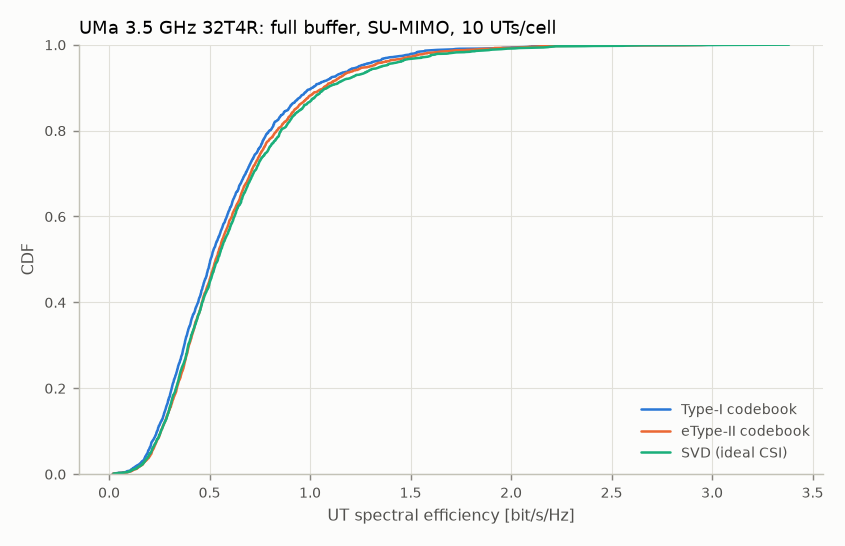

# Phase 3 — Full-buffer SU-MIMO with Type-I / eType-II CSI

Reproduce with:

```bash
python examples/run_full_buffer.py --drops 4 --jobs 4
```

This writes `results/p3_full_buffer.json` and `results/p3_ue_se_cdf.png`.

## Set-up

| Item | Value |
|---|---|
| Deployment | TR 38.901 UMa, 19 sites × 3 sectors, ISD 500 m, wrap-around; 10 UTs/cell, 80 % indoor, 3 km/h |
| Carrier | 3.5 GHz, 100 MHz, 30 kHz SCS (273 PRB), 53 dBm, UT NF 9 dB |
| gNB array | (M, N, P) = (8, 8, 2), TXRUs (Mp, Np) = (2, 8): 32 CSI-RS ports, (N1, N2) = (8, 2), (O1, O2) = (4, 4) |
| UT array | 4 ports (1 × 2 × 2 cross-polarised) |
| Channel | TR 38.901 fast fading (phase 2) for the serving cell and the K = 8 strongest interferers; the other 48 cells are wideband white interference |
| Receiver | MMSE-IRC, with the interference covariance built from the precoders the explicit interferers actually use in the slot |
| CSI | Period 5 ms (10 slots), delay 4 slots, 16-PRB sub-bands = RBGs; RI ≤ 4 |
| Scheduler | PF per RBG over a 100-slot window; HARQ retransmissions first |
| Link adaptation | CQI → SINR, per-UT OLLA (0.5 dB, 10 % BLER target); MCS table 2 (256QAM) |
| HARQ | Up to 4 transmissions, RTT 8 slots, chase combining |
| L2S | MIESM → BLER with `nrdlsim` link-level curves; TBS from TS 38.214 |
| Duration | 4 drops × 200 slots, 40 warm-up slots; 2280 UTs per configuration |

### CSI variants

- **Type-I:** TS 38.214 §5.2.2.2.1, single panel, codebook mode 1, ranks 1–4. It reports a wideband PMI (i1 and one wideband i2). The PMI is chosen by a two-stage search:
  1. rank the DFT beams by whitened power;
  2. score the codewords on the best 4 beams by their wideband rate.
- **eType-II:** TS 38.214 §5.2.2.2.5 (Rel-16), parameter combination 6 (L = 4, p_v = 1/2 or 1/4, β = 1/2). N3 = 18 PMI sub-bands (R = 1). The UE derivation works as follows:
  1. take the dominant eigenvectors per sub-band;
  2. choose the rotation and the L strongest orthogonal beams;
  3. keep the M_v strongest FD basis vectors and prune to K0 coefficients;
  4. quantise with a 4-bit reference amplitude, 3-bit differential amplitudes and 16-PSK phase.

  The payload is counted with the Part-1 and Part-2 fields.
- **SVD:** a wideband dominant right singular vector per layer, not quantised and without feedback overhead. This is the "ideal-CSI" reference for SU-MIMO with a wideband precoder.

## Results

| Precoding | Cell SE [bit/s/Hz] | 5 %-ile UT SE | Median UT SE | 1st-tx BLER | Mean rank | Mean MCS | PMI payload [bit] | Runtime (4 jobs) [s] |
|---|---|---|---|---|---|---|---|---|
| Type-I | 5.84 | 0.192 | 0.506 | 0.116 | 2.18 | 15.0 | 11 | 905 |
| eType-II (combination 6) | 6.13 (+4.9 %) | 0.213 (+10.5 %) | 0.531 | 0.116 | 2.18 | 15.6 | 677 | 966 |
| SVD (ideal, wideband) | 6.27 (+7.4 %) | 0.209 | 0.542 | 0.115 | 2.44 | 14.5 | – | 620 |



### Observations

- **Link adaptation converges.** OLLA holds the first-transmission BLER at 11.5–11.6 % against the 10 % target for all three variants. The small excess comes from CSI ageing (reports are up to 14 slots old at 3 km/h) and from interference that changes with the neighbours' PF decisions.
- **eType-II recovers about two thirds of the Type-I → SVD gap** in cell SE, at about 60× the PMI payload. At the cell edge it matches or slightly beats wideband SVD: its per-sub-band precoder follows frequency selectivity, which a wideband SVD cannot. SVD picks a higher rank (2.44) because its unquantised layers keep more of the weaker eigenmodes.
- **The gains are modest.** 5–10 % is typical for SU-MIMO. The high-resolution codebook pays off mainly in MU-MIMO, where precoder accuracy sets the residual inter-user interference; that is the next phase.
- **No direct comparison with the ITU-R M.2410 figures.** The minimum requirements (dense urban eMBB DL: 7.8 bit/s/Hz average, 0.225 bit/s/Hz at the 5th percentile) and the M.2412 / TR 37.910 industry results assume MU-MIMO, TDD frame overheads and 4 GHz. These SU-MIMO results are a baseline, not a like-for-like comparison.

## Simplifications (to revisit)

- Ideal channel estimation at the UT for CSI and demodulation. CSI-RS / CSI-IM are not modelled as REs; overhead appears only through the TBS n_oh.
- One codeword up to rank 4, and a single CQI table (table 2).
- Type-I reports a wideband i2. Sub-band i2 is not yet used, which slightly favours eType-II.
- The channel is refreshed every 10 slots (0.05 λ at 3 km/h). It is frozen between refreshes.
- Cells without a schedulable UT transmit a random rank-1 precoder, so every cell is always active (full buffer).
- eType-II at P = 32 ports only here. The codebook checks the TS 38.214 limits: P ≥ 4; combinations 3–8 not with 4 ports; combinations 7–8 only with 32 ports.

## Performance notes

- **Channel synthesis is cluster-collapsed.** Rays are summed per sub-cluster, then H(f) is formed over about 3N effective delays, stored as complex64. This matches the reference ray-level `link_channel` to about 1e-6.
- **Drops run in spawned workers with single-threaded BLAS.** With fork and multi-threaded BLAS, runs were about 20× slower.
- **CSI cost per UT report:** Type-I about 11 ms, eType-II about 37 ms (batched eigen-decompositions and projection onto all rotations), SVD about 11 ms.
