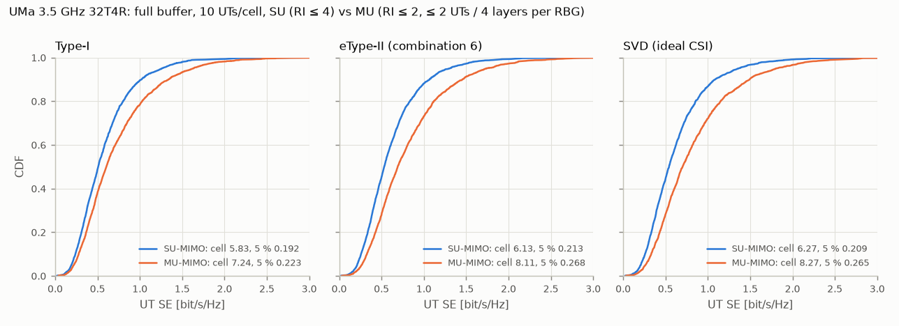

# MU-MIMO — full buffer, Type-I / eType-II / SVD reports

This is the first P5 extension of the [module plan](module-plan.md): multi-user MIMO on the phase-3 full-buffer system, UMa 3.5 GHz, 100 MHz, 32T4R, 10 UTs per cell (see [results-p3.md](results-p3.md) for the rest of the set-up).

Reproduce with:

```bash
python examples/run_full_buffer.py --mu --max-rank 2 --tag p4_mu            # MU, defaults
python examples/run_full_buffer.py --mu --max-rank 2 --mu-max-ues 4 \
    --mu-max-layers 8 --codebooks etype2 --tag p4_mu48                      # sensitivity
python examples/run_full_buffer.py --tag p3                                 # SU reference
python examples/plot_su_vs_mu.py
```

## Results

4 drops × 200 slots (40 warm-up), 2280 UTs per configuration, same drops and seeds for SU and MU. SU is the phase-3 run (RI ≤ 4, re-run with per-UT samples saved: bit-identical). MU uses RI ≤ 2, ≤ 2 UTs and ≤ 4 layers per RBG.

| Reports | Mode | Cell SE [bit/s/Hz] | 5 %-ile UT SE | Median UT SE | 1st-tx BLER | Mean MCS | UTs / layers per RBG | MU SINR estimate − actual | Runtime [s] |
|---|---|---|---|---|---|---|---|---|---|
| Type-I (sub-band i2) | SU | 5.83 | 0.192 | 0.508 | 0.117 | 15.1 | 1 / 2.18 | – | 589 |
| | MU | **7.24 (+24 %)** | **0.223 (+16 %)** | 0.605 (+19 %) | 0.113 | 11.1 | 1.95 / 3.65 | +1.6 dB | 638 |
| eType-II (combination 6) | SU | 6.13 | 0.213 | 0.531 | 0.116 | 15.6 | 1 / 2.18 | – | 840 |
| | MU | **8.11 (+32 %)** | **0.268 (+26 %)** | 0.692 (+30 %) | 0.102 | 11.8 | 1.99 / 3.83 | +0.9 dB | 736 |
| SVD (ideal, wideband) | SU | 6.27 | 0.209 | 0.542 | 0.115 | 14.5 | 1 / 2.44 | – | 561 |
| | MU | **8.27 (+32 %)** | **0.265 (+27 %)** | 0.702 (+30 %) | 0.101 | 12.0 | 1.99 / 3.84 | +0.8 dB | 609 |

Sensitivity, eType-II with ≤ 4 UTs / ≤ 8 layers per RBG: cell SE 7.29, 5 %-ile 0.243, median 0.625, 2.74 UTs / 5.26 layers per RBG, MU SINR estimate +1.6 dB. That is 10 % below the 2-UT default.



### Observations

- **MU-MIMO gains 24–32 % in cell SE and 16–27 % at the cell edge** over SU with the same reports, at about 2 co-scheduled UTs × 1.9 layers per RBG. Almost every TB (99–100 %) is co-scheduled. The per-layer SINR drops (mean MCS 15 → 11–12), but twice the UTs share each RBG.
- **eType-II's advantage over Type-I grows in MU**, as expected. It is +12 % in cell SE and +21 % at the 5th percentile in MU, against +5 % / +11 % in SU. eType-II reaches 98 % of the unquantised-SVD MU cell SE, so its 678-bit report carries almost all of what ideal wideband CSI gives the ZF precoder.
- **Type-I pairs as often but pairs worse.** Its coarse single-beam PMI hides the leakage between co-scheduled UTs. The gNB's MU-SINR estimate is 1.6 dB optimistic for Type-I, against 0.8–0.9 dB for eType-II / SVD, and OLLA runs a higher BLER (11.3 %).
- **Link adaptation holds the target**, at 10–11 % first-transmission BLER with the separate MU OLLA.
- **Compared with ITU-R M.2410.** The dense-urban eMBB minimum requirements are 7.8 bit/s/Hz average and 0.225 bit/s/Hz at the 5th percentile. eType-II and SVD MU exceed both numerically (8.11 / 0.268), and Type-I MU is just below (7.24 / 0.223). This is still **not** a like-for-like evaluation. M.2412 Dense Urban-eMBB uses a 200 m ISD macro layer at 4 GHz with 80 % indoor UTs at 3 km/h and 20 % in cars at 30 km/h, and it assumes TDD and its own overhead accounting. Here it is UMa at 500 m ISD, 3.5 GHz, all UTs at 3 km/h, with every slot downlink and no overheads beyond DM-RS.

## Simplifications (to revisit)

- **SU CSI only.** There is no MU-CQI and no rank adaptation for MU: RI is restricted to ≤ 2 for all UTs. A UT reporting rank > 2 would only be scheduled alone (not exercised with RI ≤ 2).
- **ZF on the reports**, without regularisation by the SINR (RZF / SLNR) and without per-layer power allocation.
- **Greedy pairing is myopic** (see above); no user grouping or angular pre-selection.
- **Ideal DM-RS channel estimation** of the co-scheduled layers at the UT.
- **DM-RS overhead from the layer count only.** Other overheads (CSI-RS, SSB, PDCCH) are not modelled, as in phase 3.

## Method

The gNB knows only what the UTs report: the SU CSI (RI, PMI, sub-band CQI) of TS 38.214, measured with CSI-IM on the inter-cell interference only. The UTs are not told about MU scheduling.

| Item | Model |
|---|---|
| Co-scheduling | Per RBG, greedy. The PF owner of the RBG (or its HARQ retransmission) opens the set. UTs are added while the PF metric Σ log2(1 + SINR) / R̄ of the set grows. Limits: ≤ 2 UTs, ≤ 4 layers per RBG (default; see the sensitivity case) and rank ≤ 2 per co-scheduled UT. |
| CSI | RI restricted to ≤ 2 (`--max-rank 2`) so that every UT can be paired. Type-I (sub-band i2), Rel-16 eType-II combination 6, or SVD (unquantised wideband eigenvectors, the ideal-CSI reference). |
| Precoder | Zero forcing on the stacked reported precoders: W = V (VᴴV + δI)⁻¹ with unit-norm columns, δ = 10⁻³. Each layer gets power 1/L, so the total transmit power is fixed. A UT alone on an RBG keeps its reported precoder at full power. |
| gNB MU-SINR estimate | SU CQI SINR × power split (r_u / L) × ZF projection loss ρ = \|vᴴw\|². This gives the pairing metric and the MCS. |
| MU link adaptation | A separate OLLA per UT for MU transmissions (0.5 dB, 10 % BLER target). The MU back-off relative to the SU one also scales the SINRs in the pairing metric, so UTs whose MU transmissions fail get paired less. |
| UT receiver | MMSE over all layers of the serving cell. The co-scheduled layers are known interference (their effective channels come from DM-RS), and the inter-cell interference is whitened as in SU. |
| HARQ | A retransmission joins the co-scheduled sets of its RBGs as a forced member. Its precoder is recomputed for the new set, and chase combining adds the SINRs. It keeps its TB, rank and MCS. |
| DM-RS | Up to 4 layers: type-1 single-symbol DM-RS (132 data REs per RB). A TB sharing an RBG with more than 4 layers needs ports 4–7, i.e. double-symbol DM-RS (4 × 12 DM-RS REs, 108 data REs per RB). The pairing metric pays that cost. |
| Inter-cell interference | The explicit interferers transmit their actual MU precoders (all co-scheduled layers). |

Checks (`tests/test_mu_mimo.py`):

- ZF nulls the other reported layers, and orthogonal reports lose nothing;
- the pairing takes orthogonal UTs, rejects aligned ones and respects the UT, layer and DM-RS limits;
- the MU path with pairing disabled reproduces the SU results exactly;
- the MU mode co-schedules and is reproducible.

SU mode is bit-identical to the phase-3 code.

## How the design got here

The first full-system MU run was *worse* than SU with every report type. That run allowed up to 4 UTs / 8 layers, and a retransmission took its RBGs alone. The engine's diagnostic KPIs showed why (one drop, eType-II, 120 slots):

| Variant | Cell SE | 5 %-ile | UTs / layers per RBG | RBG-slots with retransmissions | MU SINR estimate − actual |
|---|---|---|---|---|---|
| SU | 5.80 | 0.215 | 1 / 1.9 | 10.5 % | – |
| MU ≤ 4 UTs, exclusive retransmissions | 5.55 | 0.160 | 3.5 / 6.6 | 35.5 % | +2.1 dB |
| MU ≤ 4 UTs, co-scheduled retransmissions | 7.53 | 0.225 | 3.7 / 7.1 | 32.7 % | +1.6 dB |
| MU ≤ 3 UTs / 6 layers, co-scheduled retransmissions | 7.26 | 0.228 | 2.9 / 5.6 | 24.0 % | +1.5 dB |
| MU ≤ 2 UTs, co-scheduled retransmissions | **8.01** | **0.268** | 2.0 / 3.8 | 16.7 % | +0.9 dB |

Rows 3–5 were measured before the DM-RS term was added to the pairing metric. With it, the 4-UT case gives 7.15 / 0.246: the greedy search then stops at about 2.7 UTs, because it pays the DM-RS cost once a set passes 4 layers but never reaches the fourth UT that could justify it. The 2-UT case never passes 4 layers and is unaffected.

- **Exclusive MU retransmissions waste the band.** Every MU TB spans many RBGs and 10 % of them fail. When each failure takes its RBGs for a single UT, more than a third of the RBG-slots end up single-user. Co-scheduling the retransmissions fixed this.
- **More co-scheduled layers do not pay off here.** The gNB's MU-SINR estimate becomes more optimistic with every added layer (+0.9 dB at 2 UTs, +1.6 dB at 4). The per-UT MU OLLA corrects the MCS but not the pairing decisions. Above 4 layers, the double-symbol DM-RS also costs 18 % of the data REs. With 4-antenna UTs, rank-2 reports and ZF on the reports, 2 UTs × 2 layers is the best setting. The default is ≤ 2 UTs / ≤ 4 layers, with the 4 UTs / 8 layers case kept as a sensitivity run.
